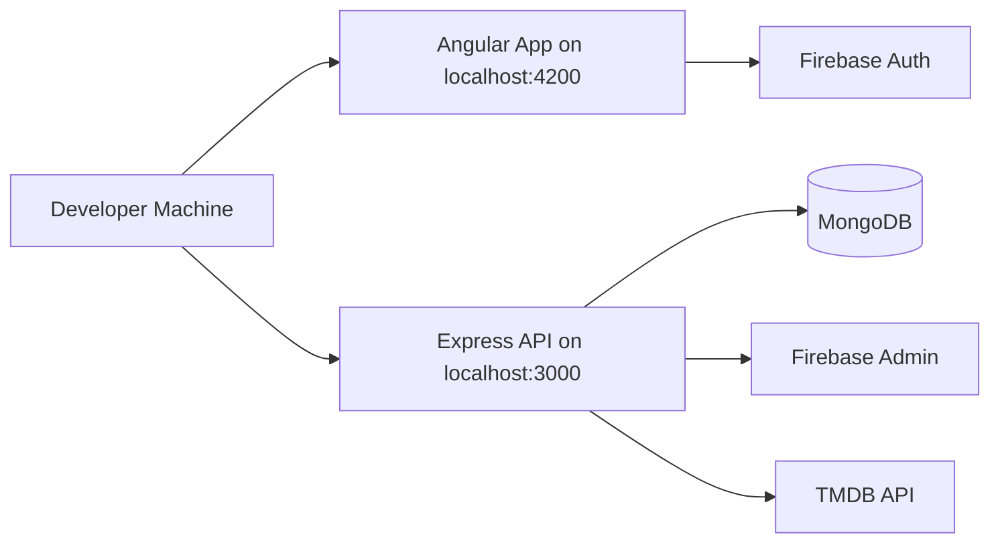
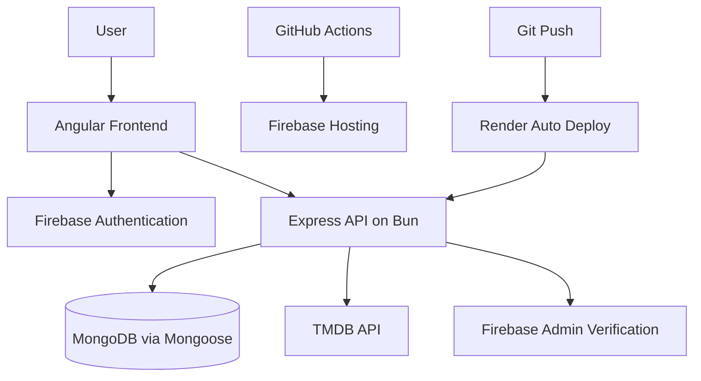
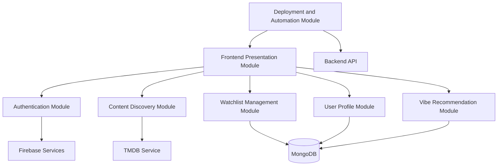
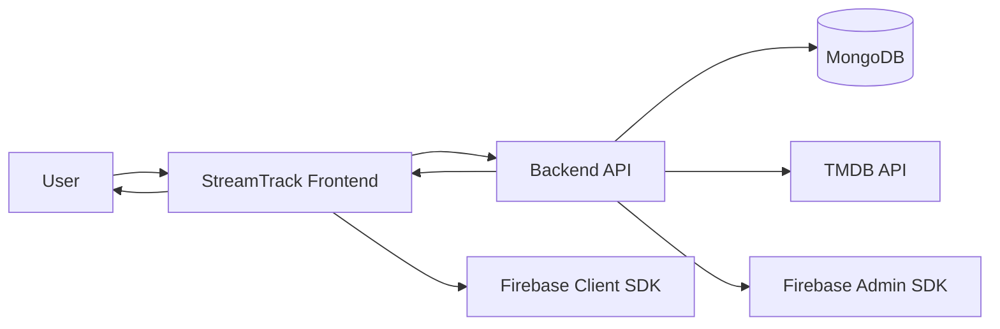
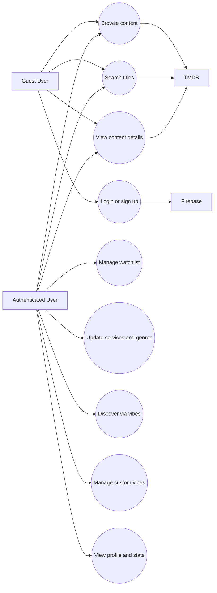
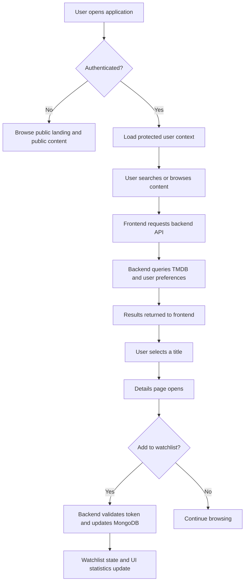
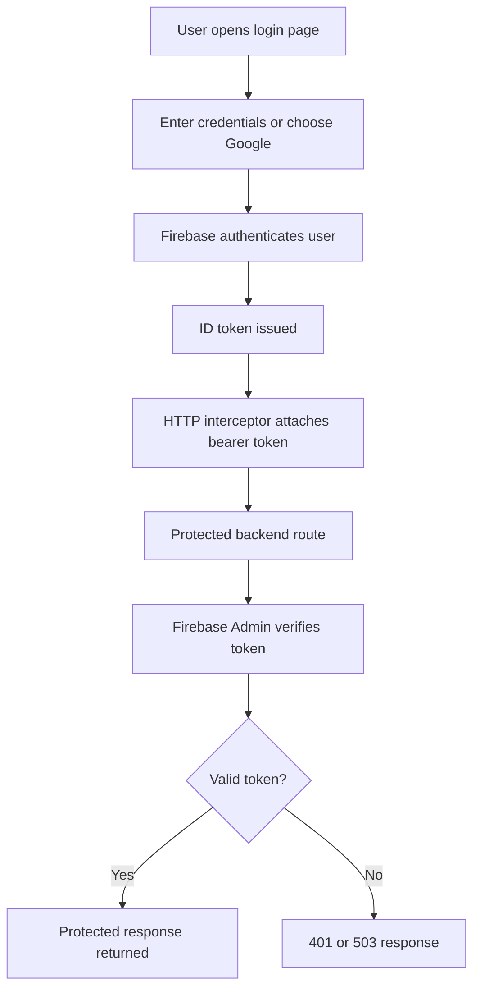
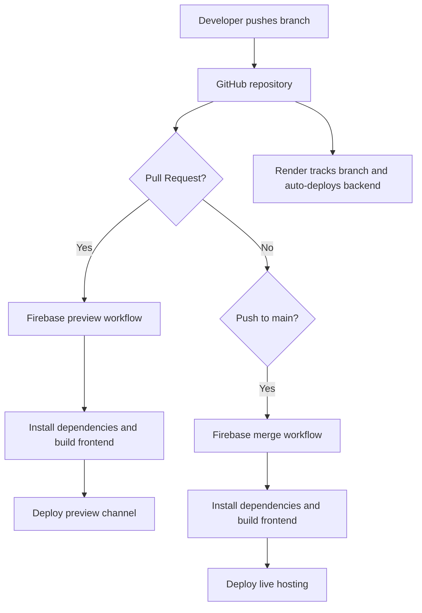
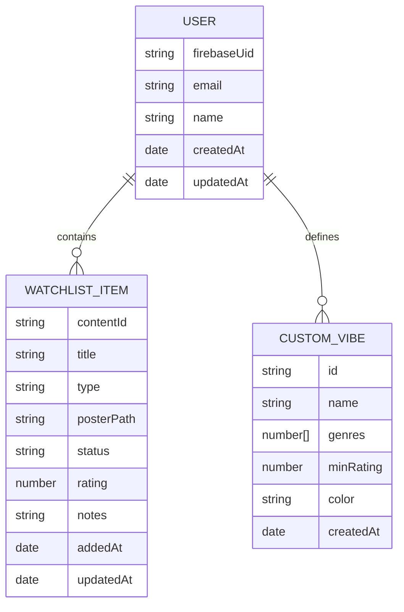

# StreamTrack Project Report

This document presents a comprehensive academic study of the StreamTrack project. The report is based on the current implementation in the repository, including the Angular frontend, the Express and Bun backend, the MongoDB data model, the Firebase authentication flow, the TMDB integration layer, the deployment configuration, and the available automation workflows. Wherever older repository notes differ from the running code, the implementation has been treated as the primary source of truth.

# 1 Introduction

## 1.1 Project description

StreamTrack is a streaming discovery and watchlist management platform designed to reduce the decision fatigue created by modern over-the-top entertainment ecosystems. In the current media landscape, viewers frequently subscribe to multiple streaming services, yet the process of deciding what to watch remains fragmented across disconnected catalogs, uneven recommendation systems, and inconsistent availability across regions and providers. StreamTrack addresses this problem by presenting a unified discovery experience that allows the user to search titles, browse curated and trending content, filter by provider, and maintain a personal watchlist inside one interface.

At a functional level, the system combines three important ideas: content discovery, personalized exploration, and lightweight tracking. Public users can explore trending titles, browse movies and television series, search the catalog, inspect title details, and view provider availability. Authenticated users gain additional capabilities, such as storing streaming service preferences, maintaining a watchlist, tracking viewing status, accessing profile data, and using custom mood-based discovery logic called "vibes". The system therefore serves both as a recommendation assistant and as a personal media organization tool.

The project is implemented as a full-stack web application. The frontend is built with Angular standalone components and Tailwind CSS, while the backend is implemented with Express on the Bun runtime. MongoDB is used for user persistence, Firebase is used for authentication, and TMDB is used as the external content data provider. This architecture allows StreamTrack to separate user identity, content metadata, personalized preferences, and deployment concerns into clear layers.

From an academic perspective, the project is significant because it represents a practical case study in full-stack web engineering. It includes client-side routing, protected application flows, API design, third-party service integration, NoSQL schema design, state management, deployment automation, and hosted production infrastructure. The project is therefore suitable not only as an entertainment application, but also as a representative educational example of modern web application architecture.

[INSERT SCREENSHOT HERE: Landing page or main product identity screen]

## 1.2 Project Profile

The project profile summarizes the identity, goals, and implementation character of StreamTrack.

| Attribute | Details |
| --- | --- |
| Project Title | StreamTrack |
| Project Category | Full-stack web application for streaming discovery and watchlist management |
| Domain | Entertainment technology / OTT content aggregation assistance |
| Primary Users | Individual streaming subscribers looking for cross-provider discovery and tracking |
| Problem Statement | OTT content is fragmented across multiple providers, making discovery and watchlist management inefficient |
| Core Objective | Help users find what to watch based on mood, provider availability, and personal interest while preserving a structured watchlist |
| Frontend Stack | Angular 21, TypeScript, Tailwind CSS v4, Lucide Angular |
| Backend Stack | Express 4 on Bun, TypeScript, Mongoose |
| Database | MongoDB |
| Authentication | Firebase client SDK and Firebase Admin verification |
| External Content Source | TMDB API |
| Hosting Strategy | Firebase Hosting for frontend, Render for backend, MongoDB deployment configurable |
| Repository Model | Bun monorepo with separate `frontend` and `backend` workspaces |

### Project stakeholders

- End users who need a simpler way to discover movies and series across services.
- Developers and maintainers responsible for frontend, backend, and deployment quality.
- Firebase and TMDB as external service providers that enable authentication and content metadata.
- Hosting platforms such as Render and Firebase Hosting that support operational deployment.
- Academic evaluators who assess the architecture, feasibility, and engineering maturity of the system.

### Problem domain summary

The central problem addressed by StreamTrack is not the absence of streaming content, but the absence of coherence across streaming experiences. Users often know that they want to watch something, but they do not know where to begin, which provider currently hosts a title, or how to remember titles for later. StreamTrack transforms this unstructured behavior into a guided digital workflow.

# 2 Environment Description

## 2.1 Hardware and Software Requirements

The environment required for StreamTrack can be described in terms of development requirements and end-user runtime requirements. Since the project includes a frontend, a backend API, a database, and third-party integrations, it requires more than a static web hosting environment.

### Development hardware requirements

| Requirement Type | Minimum Recommendation | Preferred Recommendation |
| --- | --- | --- |
| Processor | Dual-core CPU | Quad-core modern processor |
| Memory | 8 GB RAM | 16 GB RAM or higher |
| Storage | 5 GB free space | 10 GB free SSD space |
| Network | Stable internet connection | Broadband internet for dependency install and API integration |
| Display | 1366 x 768 | Full HD display for UI validation |

### Development software requirements

| Software | Purpose in Project | Notes |
| --- | --- | --- |
| Windows, Linux, or macOS | Development operating system | Repository is currently used on Windows, but stack is cross-platform |
| Bun 1.1+ | Runtime and package manager | Required for root workspace and backend runtime |
| Git | Version control | Required for repository operations and remote collaboration |
| MongoDB | Data persistence | Local MongoDB or remote connection string can be used |
| Modern web browser | Frontend testing | Chrome, Edge, Firefox, or equivalent |
| Firebase project | Authentication support | Required for both frontend Firebase config and backend admin verification |
| TMDB developer account | Content API access | Required for search, trending, details, and discovery endpoints |

### Runtime and local execution requirements

The repository expects a root `.env` file with the following key configuration values:

| Environment Variable | Purpose |
| --- | --- |
| `PORT` | Backend HTTP port, defaulting to `3000` |
| `NODE_ENV` | Runtime mode, usually `development` or `production` |
| `MONGO_URI` | MongoDB connection string |
| `TMDB_API_KEY` | TMDB v3 API key fallback |
| `TMDB_READ_ACCESS_TOKEN` | Preferred TMDB v4 read token |
| `FIREBASE_SERVICE_ACCOUNT_PATH` | Local path to Firebase Admin service account file |
| `FIREBASE_SERVICE_ACCOUNT_JSON` | Inline Firebase Admin JSON alternative |
| `ALLOWED_ORIGINS` | Comma-separated origins allowed by backend CORS |
| `NG_APP_FIREBASE_*` values | Frontend Firebase client configuration |

The backend contains an explicit environment validation utility in `backend/scripts/check-env.ts`. This script verifies the presence of a usable `.env` file, validates TMDB token structure, checks Firebase Admin credentials, and confirms MongoDB configuration before the backend starts in development mode.

### Common development commands

```bash
bun install
bun run dev
bun run build
bun run lint
bun run test
```

### Local execution topology



## 2.2 Technologies Used

The technology selection in StreamTrack is practical and layered. Each technology addresses a specific architectural responsibility instead of being included only for trend value.

| Layer | Technology | Role in the Project | Observations |
| --- | --- | --- | --- |
| Monorepo and package management | Bun workspaces | Handles dependency installation and workspace scripts | Root workspace manages `frontend` and `backend` |
| Frontend framework | Angular 21 | Builds the SPA, routing, components, and state-driven UI | Uses standalone components instead of NgModules |
| Frontend language | TypeScript | Strong typing in services, routes, and UI logic | Supports strict development practices |
| Styling | Tailwind CSS v4 and CSS variables | Provides utility-first styling and reusable design tokens | Current UI is light, minimal, and component-oriented |
| Icons | Lucide Angular | Supplies vector icons for interactive UI | Used in header, details, profile, watchlist, and cards |
| Backend framework | Express 4 | Implements HTTP routing and API middleware | Mounted in `backend/src/index.ts` |
| Backend runtime | Bun | Executes backend TypeScript and build pipeline | Used for dev, build, test, and runtime |
| Database | MongoDB | Stores user records and embedded watchlist/custom vibe data | Flexible document model suits the project |
| ODM | Mongoose | Defines schema validations and model operations | Main model is `User` |
| Authentication | Firebase Auth and Firebase Admin | Frontend sign-in plus backend token verification | Protected routes depend on proper admin initialization |
| Content provider | TMDB API | Search, trending, details, providers, and discovery metadata | Region-sensitive provider checks are an important constraint |
| Hosting | Firebase Hosting | Hosts Angular production build | GitHub Actions deploy frontend previews and production |
| Hosting | Render | Hosts backend Docker service | `render.yaml` defines dev and prod services |
| Automation | GitHub Actions | Builds and deploys frontend on PR and merge | Current workflows are frontend-focused |

### Technology interaction view



### Why this stack is appropriate

The selected stack is appropriate because it balances developer productivity, learning value, and deployability. Angular provides structure for a growing single-page application. Express remains simple and understandable for REST-based route design. MongoDB allows embedded watchlist and custom vibe data without excessive relational complexity. Firebase reduces the burden of custom authentication logic, and TMDB supplies the large-scale media dataset that would otherwise be impossible to build independently in an academic time frame.

# 3 System Analysis and Planning

## 3.1 Existing System and its Drawbacks

Before the introduction of StreamTrack, a typical user depends on separate streaming applications, browser tabs, mobile notes, or memory to manage viewing decisions. This fragmented approach creates a number of operational drawbacks.

### Drawbacks of the existing ecosystem

- Content catalogs are isolated by provider, forcing users to search the same title repeatedly across multiple platforms.
- Recommendation quality differs between services and often reflects platform incentives rather than the user's actual mood or context.
- Users frequently forget titles they intended to watch because the tracking mechanism is informal or absent.
- There is no consistent personal layer across providers for "want to watch", "currently watching", and "watched" status.
- Provider availability is region-sensitive, so a user may discover a title without knowing whether it is actually accessible in their market.
- Switching between services increases cognitive load and creates decision fatigue.

### Comparative analysis

| Existing Approach | Limitation |
| --- | --- |
| Searching directly in one OTT app | Results are limited to that provider only |
| Using general web search | Not personalized and often not organized for continued tracking |
| Maintaining a manual note or spreadsheet | Requires constant manual effort and lacks metadata enrichment |
| Using separate recommendation sites | Often disconnected from the user's personal watchlist and login state |

### Analytical conclusion

The gap is therefore not a lack of entertainment content, but a lack of orchestration across content, preference, availability, and memory. StreamTrack proposes to fill this gap by combining discovery and tracking inside a single application layer.

## 3.2 Feasibility Study

The feasibility of StreamTrack can be studied under technical, operational, economic, and schedule dimensions.

| Feasibility Dimension | Analysis | Conclusion |
| --- | --- | --- |
| Technical Feasibility | The stack uses mature and well-documented technologies such as Angular, Express, Bun, MongoDB, Firebase, and TMDB. The repository already demonstrates successful integration of these components. | Feasible |
| Operational Feasibility | End users already understand browsing, searching, signing in, and managing lists. The application model aligns with familiar consumer behavior. | Feasible |
| Economic Feasibility | The system relies on mostly free or low-cost development tools and public APIs. Hosted deployment is possible through Firebase Hosting and Render free plans for academic or prototype use. | Feasible |
| Schedule Feasibility | The project is modular and can be implemented incrementally. Public routes, auth, watchlist, and discovery are separable concerns. | Feasible with phased execution |
| Maintenance Feasibility | The codebase is structured into route modules, services, and components, making future maintenance manageable. | Feasible |

### Risk factors and mitigations

| Risk | Effect on System | Mitigation |
| --- | --- | --- |
| Firebase Admin credentials missing | Protected APIs fail | Validate environment before start and document auth dependency clearly |
| TMDB token missing or malformed | Search and discovery degrade or fail | Use `check-env.ts` and startup validation in `backend/src/config/tmdb.ts` |
| Provider availability differs by region | Filtered results may not generalize globally | Document current hardcoded `IN` region behavior and plan future configuration |
| Documentation drift | Reports may disagree with implementation | Use repository code as source of truth |
| Frontend automated tests are limited | UI regressions may go unnoticed | Include manual test cases and note future testing scope |

### Feasibility interpretation

The project is feasible because the architecture already demonstrates working integration across key functional boundaries. The primary limitations are not architectural impossibilities, but operational and completeness issues such as testing breadth, documentation consistency, and expanded provider-region robustness.

## 3.3 Requirement Gathering and Analysis

Requirements can be classified as functional requirements, non-functional requirements, external integration requirements, and implementation constraints.

### Functional requirements

#### User-facing requirements

- The system shall allow users to browse public landing content.
- The system shall allow users to search for movies and television shows.
- The system shall allow users to browse movies, TV shows, anime, and trending titles.
- The system shall provide title details such as rating, overview, cast, trailer, similar content, and provider availability.
- The system shall allow user registration and login through Firebase-backed authentication.
- The system shall allow an authenticated user to store selected streaming services.
- The system shall allow an authenticated user to maintain a watchlist with status transitions.
- The system shall provide a profile page with watchlist statistics.
- The system shall support predefined vibe-based discovery.
- The system shall support custom vibe creation, update, and deletion for authenticated users.

#### Administrative and system requirements

- The backend shall verify Firebase ID tokens for protected routes.
- The backend shall fetch content metadata from TMDB.
- The backend shall persist user documents in MongoDB.
- The system shall expose health and API information endpoints.
- The deployment process shall support hosted frontend and backend environments.

### Non-functional requirements

- Responsiveness: the UI shall remain usable across desktop and mobile layouts.
- Reliability: the API shall continue booting even if MongoDB is temporarily disconnected, while reporting its state in `/health`.
- Security: protected routes shall reject unauthorized access and require bearer tokens.
- Maintainability: frontend and backend logic shall remain modular and separated by concern.
- Performance: the backend shall use TMDB caching and request shaping to reduce unnecessary repeated API traffic.
- Scalability: the design shall allow extension to more regions, providers, and UI modules.

### External integration requirements

| Integration | Requirement |
| --- | --- |
| Firebase Client SDK | Required for frontend sign-up, login, and token issuance |
| Firebase Admin SDK | Required for backend token verification |
| TMDB API | Required for content search, trending, discovery, and provider metadata |
| MongoDB | Required for persistent user, watchlist, and custom vibe records |
| Hosting platform | Required for production publication of frontend and backend |

### Identified constraints

- The current TMDB provider filtering logic is strongly region-sensitive and defaults to `IN`.
- Current GitHub Actions automate frontend deployment only; backend deployment is handled through Render auto-deploy.
- Earlier repository notes mention onboarding and account routes that do not exist in the current frontend implementation.
- The frontend package currently lacks explicit `test` and `typecheck` scripts even though root scripts refer to them.

### Requirement analysis conclusion

The requirements reveal a system that is simultaneously user-centered and integration-heavy. StreamTrack does not merely render static pages; it depends on a coordinated relationship between client state, backend validation, database persistence, and third-party service availability. This makes clear documentation and environment preparation essential parts of the project.

# 4 Proposed System

## 4.1 Scope

The scope of StreamTrack includes discovery, personalization, tracking, and deployment support for a streaming assistance product. The proposed system is deliberately focused on features that improve the decision-making and watch management process rather than reproducing entire OTT platforms.

### In-scope functionality

| In-Scope Area | Description |
| --- | --- |
| Public content browsing | Landing page, trending content, movies, TV shows, anime, search, title details |
| Authentication | Email/password and Google-based Firebase login flow |
| Personalized preferences | Selected streaming services, stored genres, user profile retrieval |
| Watchlist management | Add, update, delete, status transition, and statistics |
| Mood-based discovery | Predefined vibes and backend-supported custom vibes |
| Provider-aware discovery | Filtered trending and provider-specific browsing where supported |
| Deployment support | Render backend, Firebase Hosting frontend, GitHub Actions for frontend deployment |

### Out-of-scope or limited-scope areas

| Out-of-Scope or Limited Area | Current Status |
| --- | --- |
| Video playback | Not implemented; the project links users to metadata and providers, not direct streaming playback |
| Payment and subscription billing | Not part of the system |
| Admin dashboard | No administrative module exists |
| Full social features | No sharing, commenting, or collaborative watchlist features |
| Complete provider-global configuration | Region logic is presently limited, with India-focused defaults in provider filtering |
| Rich onboarding flow | Mentioned in older notes, but not present in current frontend code |

### Scope boundary statement

The project is therefore best understood as a discovery-and-tracking layer rather than a replacement for streaming platforms themselves. It helps users decide, remember, and organize; it does not host or stream the underlying media assets.

## 4.2 Project modules

The proposed system is divided into clearly recognizable modules. Some are visible to the end user in the frontend, while others operate in the backend and infrastructure layers.

### 4.2.1 Frontend presentation module

This module contains the Angular application shell, route structure, responsive layouts, card components, search box behavior, and details pages. Important files include `frontend/src/app/app.component.ts`, `frontend/src/app/app.routes.ts`, and the component set under `frontend/src/app/components/`.

### 4.2.2 Authentication and identity module

This module consists of the Firebase client SDK on the frontend and Firebase Admin verification on the backend. It governs signup, login, auth state initialization, token attachment through the HTTP interceptor, and protected route enforcement.

### 4.2.3 Content discovery module

This module handles search, trending, movies, TV shows, anime, content details, similar content, and watch provider lookups. It is primarily implemented in `frontend/src/app/services/content.service.ts`, `backend/src/routes/content.routes.ts`, and `backend/src/services/tmdb.service.ts`.

### 4.2.4 Vibe recommendation module

This module maps moods or content intentions to genre and rating filters. It includes predefined vibes such as `cozy`, `intense`, `mindless`, `thoughtful`, `dark`, and `funny`, and also supports user-defined custom vibes stored in the database.

### 4.2.5 Watchlist management module

This module allows users to add titles, update viewing status, attach ratings or notes, inspect statistics, and maintain a structured list of items to revisit later. It includes both server-backed persistence and a local-storage fallback in the frontend service.

### 4.2.6 User profile and preference module

This module stores selected streaming services, preferred genres, profile information, and derived watchlist statistics. It supports the personalization layer that influences discovery results and UI presentation.

### 4.2.7 Deployment and automation module

This module includes production hosting, branch-based deployment strategy, and workflow automation. The backend is configured for Render deployment through `render.yaml` and `backend/Dockerfile`, while the frontend is deployed to Firebase Hosting with GitHub Actions support.

### Current deployment strategy

| Deployment Area | Current Strategy | Technical Basis | Important Notes |
| --- | --- | --- | --- |
| Frontend hosting | Firebase Hosting | `firebase.json` and GitHub Actions frontend build workflows | Current repository automation clearly targets Firebase Hosting rather than Vercel |
| Frontend preview deployment | Pull request preview channels | `.github/workflows/firebase-hosting-pull-request.yml` | Runs only for PRs from the same repository |
| Frontend production deployment | Live deploy on push to `main` | `.github/workflows/firebase-hosting-merge.yml` | Builds frontend and deploys hosting live channel |
| Backend development deployment | Render service `streamtrack-api-dev` | `render.yaml`, branch `dev`, Docker runtime | Uses secret environment variables configured in Render |
| Backend production deployment | Render service `streamtrack-api-prod` | `render.yaml`, branch `main`, Docker runtime | Auto-deploy enabled |
| Backend runtime image | Bun-based Docker container | `backend/Dockerfile` | Builds backend into `dist/index.js` and exposes port `3000` |

### Deployment caveat

The repository contains a historical deployment note that references a Vercel frontend strategy. However, the current operational configuration, GitHub Actions workflows, and hosting manifest indicate that Firebase Hosting is the active frontend deployment path. This distinction is important for academic accuracy.

### Module relationship diagram



## 4.3 Module-wise objectives/functionalities Constraints

The following table explains each major module in terms of its objectives, functions, and constraints.

| Module | Objective | Key Functionalities | Present Constraints |
| --- | --- | --- | --- |
| Frontend presentation | Provide a coherent and responsive user interface | Route navigation, landing page, home page, browse page, details page, watchlist page, profile page | No active onboarding route in current implementation; some UI elements are static or partially connected |
| Authentication | Secure user identity and protected actions | Signup, login, Google popup, token retrieval, auth guard, backend sync through `/auth/me` | Requires valid Firebase configuration on both client and server |
| Content discovery | Let users explore and inspect media content | Search, trending, provider-aware browsing, anime page, details, similar content, watch providers | Content quality and provider data depend on TMDB availability and region behavior |
| Vibe recommendation | Make discovery more intention-driven | Predefined vibes, custom vibe CRUD, tonight's pick heuristic | Custom vibe UI parity on frontend is incomplete; runtime filtering is not strongly enforced |
| Watchlist management | Preserve and organize future viewing decisions | Add, update, delete, stats, watch status transitions, local fallback | Minimal add flows sometimes store sparse metadata, affecting rich display fields |
| User preferences | Personalize recommendations and filtering | Save services, save genres, derive watchlist stats | Some preference-management UX mentioned in older docs is not currently visible in frontend routes |
| Deployment and automation | Publish and maintain the application | Firebase Hosting deployment, Render backend deployment, GitHub Actions previews | CI/CD is stronger for frontend than backend; older docs still reference Vercel |

### Architectural note on constraints

An important academic observation is that most current limitations are not caused by poor modularization. Instead, they result from incomplete parity between documentation and implementation, unfinished frontend testing coverage, and deployment notes that evolved over time. This is typical in student and prototype projects and should be documented explicitly rather than hidden.

# 5 Detail Planning

## 5.1 DFD / UML - Use Case & Activity Flow Diagram

This section expresses the behavioral plan of the system using textual and Mermaid-based representations.

### Level 0 data flow diagram



### Level 1 data flow interpretation

- The user interacts with the Angular frontend through public and authenticated routes.
- The frontend forwards content and account requests to the backend API.
- The backend reads or writes user records in MongoDB.
- The backend queries TMDB when public content or provider metadata is required.
- Firebase client-side login produces an ID token, and Firebase Admin validates that token for protected backend routes.

### Use case diagram



### Activity flow for authenticated discovery and watchlist addition



### Activity flow for login and protected route access



## 5.2 Process Specification

The main business and technical processes of StreamTrack can be specified as follows.

| Process ID | Process Name | Trigger | Inputs | Core Processing | Output |
| --- | --- | --- | --- | --- | --- |
| P1 | User registration and login | User submits signup or login | Credentials or Google auth popup | Firebase authenticates user, frontend obtains token, backend creates or fetches `User` record | Authenticated session and user profile |
| P2 | Public content search | User enters search text | Query string, optional page and type | Frontend calls `/api/content/search`, backend validates query and forwards to TMDB | Paged search results |
| P3 | Trending and catalog discovery | User opens home, browse, or filtered provider views | Type, page, provider, watch region | Backend or frontend requests TMDB-backed catalog endpoints and normalizes output | Trending, movie, TV, or anime lists |
| P4 | Vibe-based discovery | User chooses predefined or custom vibe | Vibe id, optional type, current user services | Backend maps vibe to genre and rating filters, queries TMDB, and filters by services | Personalized discovery set |
| P5 | Watchlist lifecycle | User adds, updates, or deletes a title | Content id, title metadata, status, rating, notes | Backend validates route payload and stores embedded watchlist item in MongoDB | Updated watchlist and statistics |
| P6 | Deployment and release | Code push or pull request | Git commit, branch state, platform secrets | GitHub Actions build frontend and deploy to Firebase Hosting; Render auto-deploys backend from tracked branches | Published preview or live environment |

### Detailed process narrative for P1: User registration and login

1. The user enters credentials or initiates Google sign-in from the frontend.
2. Firebase client SDK performs the authentication step.
3. A Firebase ID token becomes available to the frontend.
4. The frontend HTTP interceptor adds the bearer token to protected API requests.
5. The backend verifies the token using Firebase Admin.
6. The backend either creates a new `User` document or returns the existing one.
7. The frontend stores the backend user profile in reactive application state.

### Detailed process narrative for P4: Vibe-based discovery

1. The user selects a vibe identifier.
2. The frontend or user flow sends the vibe and type to the backend discover route.
3. The backend retrieves the authenticated user's selected services.
4. The vibe service maps the vibe to TMDB discover filters such as genre combinations, excluded genres, and minimum rating.
5. The TMDB service converts internal provider identifiers into TMDB provider IDs.
6. The TMDB API returns candidate results.
7. The backend returns normalized results and vibe metadata to the client.

### CI/CD process specification



### Important implementation caveat for process planning

The current repository does not include GitHub Actions for automated backend testing or deployment validation. Backend deployment is instead delegated to Render's branch-based auto-deploy process defined in `render.yaml`. This must be recorded accurately in any project evaluation.

## 5.3 Entity-Relationship Diagram

The data model is centered around a single `User` document. Instead of creating many top-level collections, StreamTrack embeds watchlist items and custom vibes directly inside the user record. This design is appropriate because the watchlist and custom vibes are tightly coupled to the identity of a single user and are almost always accessed together.

### ER diagram



### ER interpretation

- A `USER` owns zero or more `WATCHLIST_ITEM` entries.
- A `USER` owns zero or more `CUSTOM_VIBE` entries.
- `firebaseUid` serves as the primary identity bridge between Firebase and MongoDB.
- Watchlist and custom vibe records are embedded because they are user-scoped and do not require cross-user joins.

### External relationship note

TMDB and Firebase are external systems rather than local entities in the database. TMDB content objects are fetched dynamically and normalized at runtime, while Firebase tokens are verified per request. Therefore, both are part of the operational architecture but not part of the MongoDB ER structure itself.

# 6 System Design

## 6.1 Database Design

The database design of StreamTrack uses MongoDB with Mongoose schemas to represent user-level personalization and tracking data. A single primary `User` collection simplifies access patterns and reduces relational overhead.

### Primary collection design

| Field | Type | Description | Validation or Design Note |
| --- | --- | --- | --- |
| `firebaseUid` | String | Unique Firebase identity key | Required, unique, indexed |
| `email` | String | User email address | Required |
| `name` | String | Optional display name | Optional |
| `services` | String array | Selected streaming providers | Defaults to empty array |
| `genres` | Number array | Selected genre IDs | Defaults to empty array |
| `watchlist` | Embedded documents | User watchlist items | Defaults to empty array |
| `customVibes` | Embedded documents | User-defined vibes | Maximum 5 |
| `createdAt` | Date | Creation timestamp | Auto-managed by schema timestamps |
| `updatedAt` | Date | Last update timestamp | Auto-managed by schema timestamps |

### Embedded watchlist item design

| Field | Type | Meaning | Validation |
| --- | --- | --- | --- |
| `contentId` | String | Stored content identifier | Required |
| `title` | String | Display title | Required |
| `type` | String | `movie` or `tv` | Enum enforced |
| `posterPath` | String | Poster reference path or URL | Optional |
| `status` | String | `want`, `watching`, or `watched` | Enum enforced |
| `rating` | Number | Optional user rating | Range `0` to `10` |
| `notes` | String | Optional comment field | Optional |
| `addedAt` | Date | Initial list addition time | Default current date |
| `updatedAt` | Date | Modification timestamp | Optional update field |

### Embedded custom vibe design

| Field | Type | Meaning | Validation |
| --- | --- | --- | --- |
| `id` | String | Internal custom vibe id | Required |
| `name` | String | User-defined vibe name | Required, max 50 chars |
| `genres` | Number array | TMDB genre IDs composing the vibe | Non-empty array required |
| `minRating` | Number | Optional quality threshold | Range `0` to `10` |
| `color` | String | Optional hex theme color | Must match `#RRGGBB` |
| `createdAt` | Date | Creation timestamp | Default current date |

### Sample stored user document

```json
{
  "firebaseUid": "abc123uid",
  "email": "user@example.com",
  "name": "Sample User",
  "services": ["netflix", "prime", "jiohotstar"],
  "genres": [28, 35, 18],
  "watchlist": [
    {
      "contentId": "movie-550",
      "title": "Fight Club",
      "type": "movie",
      "posterPath": "/poster.jpg",
      "status": "want",
      "rating": 8,
      "notes": "Recommended by a friend",
      "addedAt": "2026-03-27T10:00:00.000Z",
      "updatedAt": "2026-03-27T10:00:00.000Z"
    }
  ],
  "customVibes": [
    {
      "id": "cv_demo_01",
      "name": "Weekend Action",
      "genres": [28, 53],
      "minRating": 7.5,
      "color": "#1E40AF",
      "createdAt": "2026-03-27T10:00:00.000Z"
    }
  ]
}
```

### Database design rationale

The embedded-document approach suits the project because watchlist items and custom vibes are strongly user-owned. A normalized relational structure would not provide significant analytical benefit for the current use case, while it would increase complexity for read and write operations. The current design optimizes for the real access pattern of the application: load the user and their personalized state together.

### Constraints and design considerations

- Duplicate watchlist entries are prevented at the route level through `contentId` checks.
- Custom vibes are capped at five per user.
- Current design is ideal for single-user personalization, but would need revision for collaborative lists or social features.
- Rich analytics across all watchlist items would become easier if watchlist data were later extracted into a dedicated collection.

## 6.2 User interface

The user interface of StreamTrack is a route-driven single-page application built with Angular standalone components. The application emphasizes card-based browsing, a compact persistent header, provider filters, title details, and lightweight profile management.

### Current route inventory

| Route | Purpose | Access Type |
| --- | --- | --- |
| `/` | Landing page | Public |
| `/home` | Primary discovery home with hero and content rails | Public |
| `/browse/:category` | Category browsing for movies, TV, trending, or anime | Public |
| `/search` | Search results page | Public |
| `/movie/:id` | Movie detail page | Public |
| `/tv/:id` | TV detail page | Public |
| `/details/:type/:id` | Generic details route | Public |
| `/vibes` | Vibe page | Public |
| `/login` | Login page | Public |
| `/signup` | Signup page | Public |
| `/profile` | Profile and statistics page | Protected |
| `/watchlist` | Watchlist management page | Protected |

### UI sitemap

```mermaid
flowchart TD
    Root[/]/ --> Home[/home/]
    Root --> Signup[/signup/]
    Root --> Login[/login/]
    Home --> Browse[/browse/:category/]
    Home --> Search[/search?q=.../]
    Home --> Details[/movie/:id or /tv/:id/]
    Home --> Watchlist[/watchlist/]
    Home --> Profile[/profile/]
    Home --> Vibes[/vibes/]
```

### User interface design characteristics

- The current visual style is light, minimal, and heavily card-based.
- A fixed header provides navigation, provider pills, search expansion, and auth actions.
- The landing page is separate from the main shell and hides the persistent header.
- Route transitions use Angular animations for detail views and shell navigation.
- Tailwind utility classes and CSS variables in `frontend/src/styles.css` provide the shared design foundation.
- Lucide icons support consistent visual semantics across interactive actions.

### Key screens and their functions

| Screen | Function | Notes |
| --- | --- | --- |
| Landing page | Introduces product and directs user to home or signup | Public entry point |
| Home page | Shows hero pick and content rails | Provider filter influences content |
| Browse/Search page | Displays paginated results | Search route reuses browse component |
| Content details page | Shows metadata, providers, trailer, similar titles | Supports watchlist actions |
| Watchlist page | Displays list filtered by status and genre | Protected route |
| Profile page | Displays user info and watchlist statistics | Protected route |
| Login/Signup pages | Collect credentials and start Firebase auth | Public auth routes |
| Vibes page | Displays vibe options | Current UI is more static than fully backend-driven |

### Screenshot placeholders

[INSERT SCREENSHOT HERE: Landing Page]

[INSERT SCREENSHOT HERE: Home Page with Hero and Content Rails]

[INSERT SCREENSHOT HERE: Browse or Search Results Page]

[INSERT SCREENSHOT HERE: Content Details Page]

[INSERT SCREENSHOT HERE: Watchlist Page]

[INSERT SCREENSHOT HERE: Profile Page]

[INSERT SCREENSHOT HERE: Login or Signup Page]

### UI design observation

Some earlier project notes describe onboarding and account routes that are not reflected in the current frontend source. The present implementation should therefore be documented as it exists now: landing, home, browse, details, watchlist, profile, login, signup, and vibes.

# 7 Software Testing & Test Cases

Software testing in StreamTrack currently emphasizes backend behavior more strongly than frontend automation. The repository contains backend tests written with Bun test utilities and Supertest, while frontend test files are presently absent. Therefore, a balanced testing chapter must describe both implemented tests and recommended manual test cases.

### Existing automated test coverage

| Area | Current Coverage |
| --- | --- |
| Auth middleware | Token verification and protected access behaviors |
| Watchlist routes | Add, get, update, delete, stats, invalid status/type/rating validation |
| User genre routes | Validation behavior for genre updates |
| Discover routes | Validation and custom vibe route behavior |
| Vibe service | Vibe configuration and discovery-related logic |

### Current testing limitations

- Frontend `*.spec.ts` files are not currently present.
- Frontend package scripts do not currently define explicit `test` or `typecheck` commands, although the root workspace expects them.
- Several tests rely on a local MongoDB test database rather than an isolated in-memory instance.
- External integrations such as TMDB are not comprehensively covered by automated route tests.

### Suggested testing strategy

The project should be evaluated using a hybrid strategy:

- automated backend validation for API logic,
- manual UI testing for frontend navigation and interactions,
- smoke testing for deployment,
- environment testing for authentication and third-party integrations.

### Representative test cases

| Test Case ID | Module | Scenario | Test Input or Precondition | Expected Result |
| --- | --- | --- | --- | --- |
| TC-01 | Health API | Check service health | `GET /health` | Returns status, timestamp, and MongoDB connection state |
| TC-02 | Auth | Register new user | Valid Firebase token and signup form | User document is created or returned |
| TC-03 | Auth | Access protected route without token | No `Authorization` header | Request rejected with `401` |
| TC-04 | Auth | Access protected route when Firebase Admin unavailable | Misconfigured Firebase Admin | Request rejected with `503` |
| TC-05 | Search | Search valid title | Query such as `inception` | Returns paginated results |
| TC-06 | Search | Search with empty query | Missing `query` or `q` | Returns `400` validation error |
| TC-07 | Watchlist | Add valid watchlist item | Authenticated request with `contentId`, `title`, and `type` | Item created with default `want` status |
| TC-08 | Watchlist | Prevent duplicate watchlist item | Same `contentId` added twice | Returns conflict or duplicate error |
| TC-09 | Watchlist | Update watchlist status | Existing item, valid status such as `watched` | Status updated successfully |
| TC-10 | Watchlist | Reject invalid watchlist type | `type = podcast` | Returns validation error |
| TC-11 | Vibes | Discover by predefined vibe | Valid auth token and vibe id | Returns results and vibe metadata |
| TC-12 | Vibes | Create custom vibe | Valid name, genres, and optional min rating | Custom vibe stored for user |
| TC-13 | Vibes | Reject sixth custom vibe | User already has 5 custom vibes | Returns validation error |
| TC-14 | Profile | Load protected profile page | Authenticated user | Profile and stats visible |
| TC-15 | Deployment | Build frontend on PR | Pull request from same repository | GitHub Action deploys Firebase preview |

### Manual UI validation checklist

1. Open the landing page and confirm the main CTA routes correctly.
2. Use the search box in the header and verify the URL updates with the query.
3. Open a content details page from a card and verify title metadata is shown.
4. Login and confirm access to `/profile` and `/watchlist`.
5. Add a title to the watchlist from the hero or card button.
6. Change watchlist status across `want`, `watching`, and `watched`.
7. Confirm provider pill changes refresh home content.
8. Confirm logout removes access to protected routes.

### Testing commands

```bash
# backend tests
cd backend
bun run test

# linting
bun run lint

# full dev mode from repository root
cd ..
bun run dev
```

### Testing conclusion

The backend already demonstrates meaningful validation-oriented testing, especially around watchlist and auth-sensitive flows. The most important future improvement in testing is the addition of frontend automation and the alignment of root workspace scripts with the frontend package configuration.

# 8 Future Scope of Enhancements

StreamTrack already provides a solid functional base, but there is substantial room for future enhancement in both user experience and system quality.

### Product and UX enhancements

- Introduce a complete onboarding flow for service and genre selection in the current frontend.
- Build a richer custom vibe management interface with create, edit, and delete controls visible in the UI.
- Add deeper title metadata such as reviews, availability alerts, runtime filters, and richer cast exploration.
- Provide better empty states, recommendation explanations, and guided discovery journeys.
- Add collaborative or shared watchlists for couples, families, or friend groups.

### Personalization enhancements

- Make watch region configurable per user instead of relying on a backend default.
- Improve the "Tonight's Pick" heuristic with learned user behavior and watch history.
- Add content exclusion features such as hidden titles, disliked genres, or spoiler avoidance.
- Support personalized recommendation history and recommendation feedback loops.

### Engineering and quality enhancements

- Normalize API error response shapes across backend route modules.
- Add frontend automated tests and restore root-level test and typecheck consistency.
- Expand backend tests for auth routes, content routes, and TMDB integration behavior.
- Add backend CI quality gates in GitHub Actions instead of relying only on frontend deployment workflows.
- Introduce observability such as request logging, error monitoring, and hosted environment diagnostics.

### Infrastructure and deployment enhancements

- Add separate formal staging and production environments for both frontend and backend.
- Improve secret management and deployment documentation to avoid historical drift.
- Replace or supplement branch-based auto-deploy with explicit pipeline stages and environment checks.
- Consider CDN strategy and API caching improvements for large-scale browsing workloads.

### Long-term academic and practical value

Future enhancement work would transform StreamTrack from a strong prototype into a more production-ready intelligent media assistant. The existing codebase already contains enough architectural separation to support such growth incrementally.

# 9 References

### Internal project references

- `AGENTS.md`
- `Tasks.md`
- `package.json`
- `frontend/package.json`
- `backend/package.json`
- `frontend/src/app/app.routes.ts`
- `frontend/src/app/app.component.ts`
- `frontend/src/app/app.config.ts`
- `frontend/src/app/services/auth.service.ts`
- `frontend/src/app/services/content.service.ts`
- `frontend/src/app/services/watchlist.service.ts`
- `frontend/src/app/components/header.component.ts`
- `frontend/src/app/components/hero.component.ts`
- `frontend/src/app/components/browse-page.component.ts`
- `frontend/src/app/components/watchlist.component.ts`
- `frontend/src/app/components/profile.component.ts`
- `frontend/src/styles.css`
- `frontend/src/environments/environment.ts`
- `frontend/src/environments/environment.prod.ts`
- `backend/src/index.ts`
- `backend/src/middleware/auth.middleware.ts`
- `backend/src/routes/auth.routes.ts`
- `backend/src/routes/user.routes.ts`
- `backend/src/routes/content.routes.ts`
- `backend/src/routes/discover.routes.ts`
- `backend/src/routes/watchlist.routes.ts`
- `backend/src/models/User.ts`
- `backend/src/services/firebase.service.ts`
- `backend/src/services/tmdb.service.ts`
- `backend/src/services/vibe.service.ts`
- `backend/src/config/tmdb.ts`
- `backend/scripts/check-env.ts`
- `render.yaml`
- `firebase.json`
- `.github/workflows/firebase-hosting-merge.yml`
- `.github/workflows/firebase-hosting-pull-request.yml`
- `specs/BUILD.md`
- `specs/API_TESTING.md`
- `specs/IMPLEMENTATION_PLAN.md`

### External technical references

- Angular Documentation: https://angular.dev/
- Bun Documentation: https://bun.sh/docs
- Express Documentation: https://expressjs.com/
- MongoDB Documentation: https://www.mongodb.com/docs/
- Mongoose Documentation: https://mongoosejs.com/docs/
- Firebase Authentication Documentation: https://firebase.google.com/docs/auth
- Firebase Admin SDK Documentation: https://firebase.google.com/docs/admin
- TMDB API Documentation: https://developer.themoviedb.org/
- Firebase Hosting Documentation: https://firebase.google.com/docs/hosting
- GitHub Actions Documentation: https://docs.github.com/actions
- Render Documentation: https://render.com/docs

### Reference note

This report intentionally prioritizes the implemented repository over outdated or superseded descriptive notes. As a result, it documents the current state of the system with explicit acknowledgement of drift where necessary.
